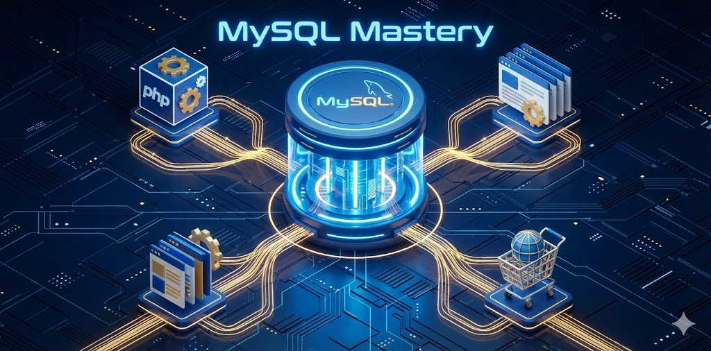

# 🚀 MySQL Mastery: From Beginner to Senior

Welcome to the comprehensive **MySQL Mastery Course**. This open-source project is designed to transform developers into Senior Database Engineers.

Please choose your language to start learning:

---

## 🌍 Languages

### 🇬🇧 [English Version (Click Here)](./EN/README.md)
Complete course in English, covering advanced optimization, architecture, and integration with Laravel & WordPress.

### 🇮🇷 [نسخه فارسی (کلیک کنید)](./FA/README.md)
دوره جامع و کامل به زبان فارسی، شامل تمامی مباحث پیشرفته، بهینه‌سازی و نکات بومی‌سازی شده.

---

## 🌟 Key Features
* **Deep Dive:** Understanding the "WHY", not just commands.
* **Performance:** Advanced Indexing, EXPLAIN analysis, and Server Tuning.
* **Real-World:** Dedicated chapters for **Laravel** and **WordPress**.
* **Hands-on:** Practical examples (`.sql`, `.php`) for every lesson.

## 🤝 Contributing
Contributions are welcome! Please feel free to submit a Pull Request.

## 📜 License
This project is licensed under the MIT License.